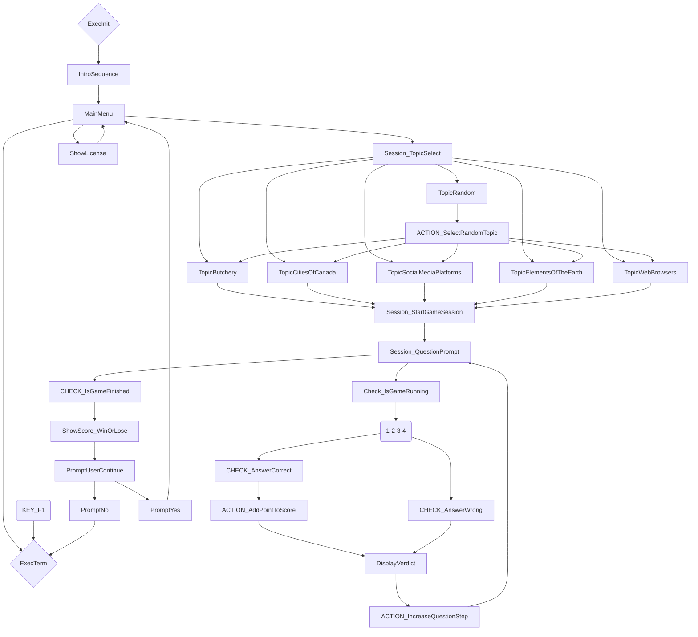
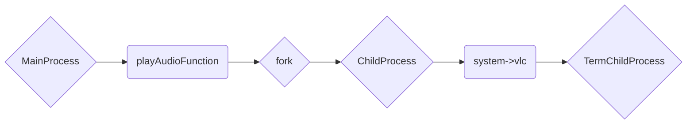
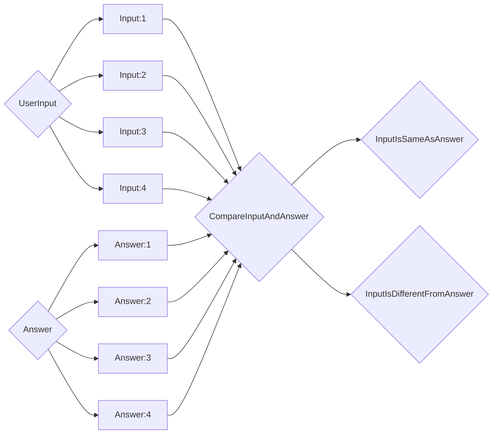

# Trivia Overdrive
<h1 align="center">Trivia Overdrive</h1>

	
    

    Command-line trivia game built with ncurses for a college class

Trivia Overdrive is a fun and simple terminal-based trivia game intended for my final project of the Microprocessors I course. It also utilizes ncurses for UI, as an extra fun attempt at UI/UX eye-candy and a personal challenge for bettering my skills. Due to some weird issues with attempting to include the PDcurses libraries on our Windows 11 lab computers, I opted to write this on Linux and potentially set up a github workflow to build the application automatically and perhaps have it compile a Windows-compatible version.

## TODO:
The following are my goals with this project, as for what I can achieve by the submission date or beyond.
- [x] Write the core functionality: the main functions that allow me to track scores, hold the questions, etc.
- [x] Write the curses UI: the primary UI of the project
- [ ] Automatically port to Windows: As explained above, we were technically required to build these applications on Windows to streamline the grading process, however it has evidently not been super possible to do. This is likely to be a github workflow.

## The key requirements of the project
The project was subjected to several requirements as to allow for streamlined grading guidelines by the professor. Such requirements were (but not limited to):
* Utilizing arrays for storing the questions;
* Randomizing the array index to present a different question each time;
* Ensuring that input types align with the specifications (strings, integers, etc);
* Implementing sound effects using WAV files for various stages (game start, right/wrong answers, score display, ambient music, etc);
* Offering an option to quit the game or continue for more questions during gameplay;
* Implementing a score counter to track progress

## Visual representation and test case checks
The following information is required as part of the submission process, as to prove that I have a deep understanding of the project, testing it and verifying it works before submission.

As per how Trivia Overdrive works in general, the following mermaid chart summarizes the paths the program goes through based on user input.

The following describes in brief detail the way we achieve audio with the taken approach. As I had limited time, I needed to make sure I could play sound effects asynchronously to enhance feedback to the player. This is the approach I came up with, by creating a child process and passing off sounds to VLC: 

Note that during all animations, keypresses are put into a queue until arriving to a `getch()` call, which unless looped, will only take one from the queue. All `getch()`-based calls are either checked for valid input or used as a `press any key to continue` prompt. For this reason, all input scenarios are not prone to unexpected behavior. Also note that many navigation menus in this game use a loop that relies on `getch()` not reading `KEY_F(13)`, which is not a standard key available on standard keyboards. If you use a custom keyboard which _does_ use the additional Function keys such as `KEY_F(13)`, you may encounter unexpected behavior that would result in a segmentation fault. As of the time of writing this report, I do not know of a standard key that would never make it on keyboards, so this solution works for me.

### Immediate exit cases
Trivia Overdrive allows you to quit immediately without effort via `KEY_F(1)`, which is the `F1` key. The following scenarios are all places where the key can be used and is tested.
|**Scenario**                        |**Action**      |**Expected behavior**|**Actual Behavior**|**Result**|
|------------------------------------|----------------|---------------------|-------------------|----------|
|Quit immediately from Main Menu     |Press `KEY_F(1)`|Quits immediately    |Quits immediately  |PASS      |
|Quit immediately from Topic Selector|Press `KEY_F(1)`|Quits immediately    |Quits immediately  |PASS      |
|Quit immediately during Game Session|Press `KEY_F(1)`|Quits immediately    |Quits immediately  |PASS      |
|Quit immediately at final prompt    |Press `KEY_F(1)`|Quits immediately    |Quits immediately  |PASS      |

### Menu navigation cases
Trivia Overdrive makes use of 3 different navigation menus which makes use of the arrow keys for movement. This makes for an interesting test case as the way it was programmed would only allow it to choose the action once you press the `ENTER` key. Note that wrap-arounds are trivial and essentially check if the position is lower than minimums or higher than maximums in the grid and sets it to the maximum or minimum respectively, hence the simple test case.
|**Scenario**                               |**Action**                                                             |**Expected behavior**                       |**Actual Behavior**                         |**Result**|
|-------------------------------------------|-----------------------------------------------------------------------|--------------------------------------------|--------------------------------------------|----------|
|_Main Menu navigation_                     |                                                                       |                                            |                                            |          |
|Move selector downwards                    |Press `KEY_DOWN` or `KEY_RIGHT`                                        |Moves it by one position downwards          |Moves it by one position downwards          |PASS      |
|Move selector upwards                      |Press `KEY_UP` or `KEY_LEFT`                                           |Moves it by one position upwards            |Moves it by one position upwards            |PASS      |
|Wrap selector around to the opposite point |When on either edges, use appropriate arrow keys to cause a wrap-around|Wraps around both ways                      |Wraps around both ways                      |PASS      |
|_Topic Selection navigation_               |                                                                       |                                            |                                            |          |
|Move selector downwards                    |Press `KEY_DOWN`                                                       |Moves the selector by one position downwards|Moves the selector by one position downwards|PASS      |
|Move selector upwards                      |Press `KEY_UP`                                                         |Moves the selector by one position upwards  |Moves the selector by one position upwards  |PASS      |
|Move selector to the right                 |Press `KEY_RIGHT`                                                      |Moves the selector to the right             |Moves the selector to the right             |PASS      |
|Move selector to the left                  |Press `KEY_LEFT`                                                       |Moves the selector to the left              |Moves the selector to the left              |PASS      |
|Wrap selector around to the opposite points|When on either edges, use appropriate arrow keys to cause a wrap-around|Wraps around both ways                      |Wraps around both ways                      |PASS      |
|_Play Again Prompt navigation_             |                                                                       |                                            |                                            |          |
|Move selector to the left                  |Press `KEY_UP` or `KEY_LEFT`                                           |Moves the selector to the left              |Moves the selector to the left              |PASS      |
|Move selector to the right                 |Press `KEY_DOWN` or `KEY_RIGHT`                                        |Moves the selector to the right             |Moves the selector to the right             |PASS      |
|Wrap selector around to the opposite point |When on either edges, use appropriate arrow keys to cause a wrap-around|Wraps around both ways                      |Wraps around both ways                      |PASS      |

### Menu Selection cases
As described previously, Trivia Overdrive allows you to navigate the options before you select it. The following table assumes that with each scenario, you navigated to the button on screen before pressing the `ENTER` key.
|**Scenario**                  |**Action**                        |**Expected behavior**                                                      |**Actual Behavior**                                                        |**Result**|
|------------------------------|----------------------------------|---------------------------------------------------------------------------|---------------------------------------------------------------------------|----------|
|_Main Menu navigation_        |_Actions assume proper navigation_|                                                                           |                                                                           |          |
|Select the `START` option     |Press `ENTER`                     |The selection sends you to the Topic Selection menu                        |The selection sends you to the Topic Selection menu                        |PASS      |
|Select the `LICENSE` option   |Press `ENTER`                     |The selection sends you to a menu that shows you the license               |The selection sends you to a menu that shows you the license               |PASS      |
|Select the `LEAVE` option     |Press `ENTER`                     |The selection quits the game                                               |The selection quits the game                                               |PASS      |
|_Topic Selection navigation_  |_Actions assume proper navigation_|                                                                           |                                                                           |          |
|Select the `RANDOM!` option   |Press `ENTER`                     |The selection starts a game session with one of the topics chosen at random|The selection starts a game session with one of the topics chosen at random|PASS      |
|Select the `MEATS` option     |Press `ENTER`                     |The selection starts a game session with the butchery topic                |The selection starts a game session with the butchery topic                |PASS      |
|Select the `TOWNS` option     |Press `ENTER`                     |The selection starts a game session with the cities of canada topic        |The selection starts a game session with the cities of canada topic        |PASS      |
|Select the `MEDIA` option     |Press `ENTER`                     |The selection starts a game session with the social media platforms topic  |The selection starts a game session with the social media platforms topic  |PASS      |
|Select the `ELEMENT` option   |Press `ENTER`                     |The selection starts a game session with the elements of the earth topic   |The selection starts a game session with the elements of the earth topic   |PASS      |
|Select the `BROWSER` option   |Press `ENTER`                     |The selection starts a game session with the web browsers topic            |The selection starts a game session with the web browsers topic            |PASS      |
|_Play Again Prompt navigation_|_Actions assume proper navigation_|                                                                           |                                                                           |          |
|Select the `YES` option       |Press `ENTER`                     |The selection sends you to the Main Menu                                   |The selection sends you to the Main Menu                                   |PASS      |
|Move selector to the right    |Press `ENTER`                     |The selection quits the game                                               |The selection quits the game                                               |PASS      |

### Game Session input cases
Trivia Overdrive makes use of shuffled arrays via the Fisher-Yates shuffle algorithm. This makes testing each individual case impossible for a test case sheet for each possible question and answers (As it stands, the game totals 75 total questions and 300 total answers, not to mention each session being shuffled randomly for a unique order every time). However, the approach taken for input keys lies in how we compare answers. The last character of a string in each array is set to a number between 1 to 4. This results in the unique opportunity for comparing directly the user input to the answer. So therefore, the following mermaid chart describes this visually:

## The point of this project being open-source
I'm a huge proponent of free and open source software, regardless of how bad or stellar the quality of my work is. I know that my work may help someone with a similar idea or is just generally trying to learn C on their own, which is why I decided to license it under the MIT license. I would suggest as courtesy to also have your derivative projects be open source, but since I understand that some projects may not be allowed that luxury, you have that freedom as a result of the chosen license.

The following is a copy of the license, which can also be found under the LICENSE file:

**Copyright (c) 2023 Lexi Charron**

Permission is hereby granted, free of charge, to any person obtaining a copy
of this software and associated documentation files (the "Software"), to deal
in the Software without restriction, including without limitation the rights
to use, copy, modify, merge, publish, distribute, sublicense, and/or sell
copies of the Software, and to permit persons to whom the Software is
furnished to do so, subject to the following conditions:

The above copyright notice and this permission notice shall be included in all
copies or substantial portions of the Software.

THE SOFTWARE IS PROVIDED "AS IS", WITHOUT WARRANTY OF ANY KIND, EXPRESS OR
IMPLIED, INCLUDING BUT NOT LIMITED TO THE WARRANTIES OF MERCHANTABILITY,
FITNESS FOR A PARTICULAR PURPOSE AND NONINFRINGEMENT. IN NO EVENT SHALL THE
AUTHORS OR COPYRIGHT HOLDERS BE LIABLE FOR ANY CLAIM, DAMAGES OR OTHER
LIABILITY, WHETHER IN AN ACTION OF CONTRACT, TORT OR OTHERWISE, ARISING FROM,
OUT OF OR IN CONNECTION WITH THE SOFTWARE OR THE USE OR OTHER DEALINGS IN THE
SOFTWARE.
